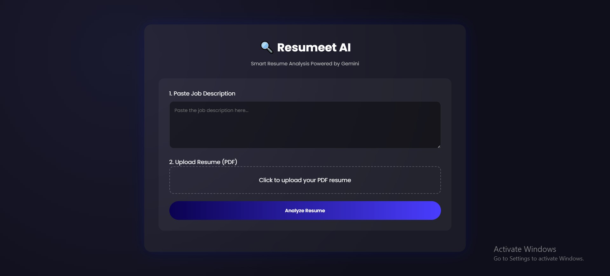
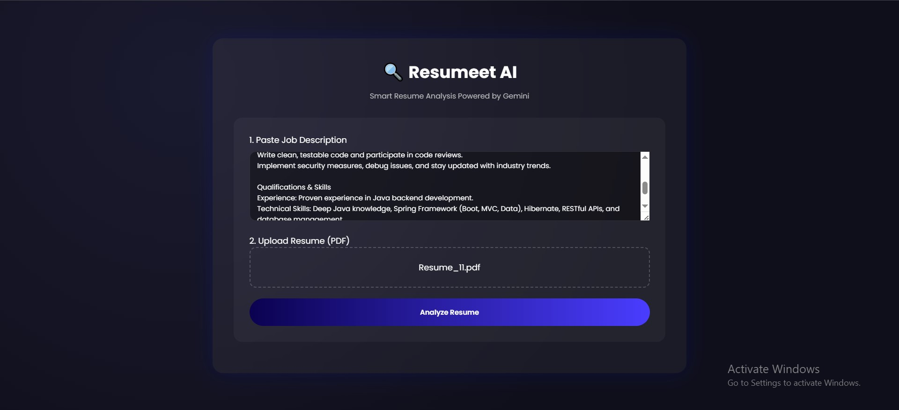
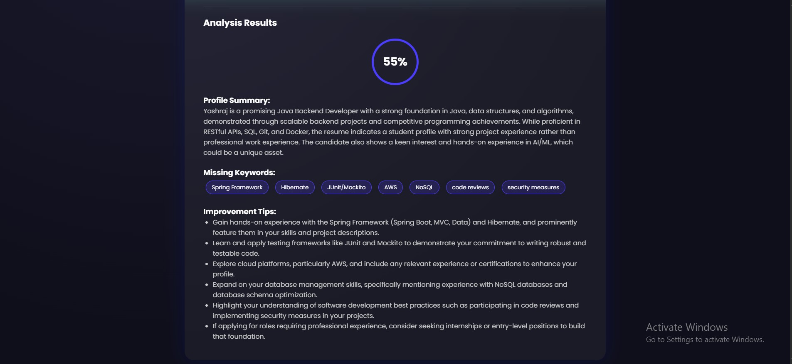

#  📄 Resumeet AI: Advanced ATS Intelligence

Precision Resume Analysis Powered by Gemini 2.5 Flash

Resumeet AI is a sophisticated recruitment intelligence tool that bridges the gap between candidate profiles and job requirements. By leveraging Large Language Models (LLMs), it deconstructs complex resumes into actionable data points, providing recruiters and job seekers with a definitive "Match Score" and strategic improvement roadmap.

---

## ✨ Executive Features

Deep Contextual Analysis: Unlike traditional keyword-stuffing parsers, Resumeet understands the intent and seniority of experience relative to the Job Description.

Automated Gap Discovery: Instantly identifies missing technical and soft skills (Keywords) that are critical for ATS passing.

Strategic Improvement Roadmap: Provides candidates with high-impact, actionable tips to refine their profile for specific roles.

High-Fidelity PDF Parsing: Utilizes optimized extraction logic to handle complex multi-column resume layouts.

---

## 📸 Interface Preview

- The Command Center
    

- Usage
    
    
- Real-Time Intelligence
    

---

## 🛠️ The Tech Stack

- Brain	: Google Gemini 2.5 Flash (LLM)
- Backend :	Python / Flask
- Intelligence SDK : Google GenAI (Modern Client-First Architecture)
- Document Engine : PyPDF2
- Frontend : HTML5 / CSS3 (Responsive Dark Mode)

---

## ⚙️ Installation & Setup

- Clone the repository:
```
git clone https://github.com/yashrajkore/Resumeet.git
cd Resumeet
```

- Initialize environment:
```
pip install -r requirements.txt
```

- Launch the Engine:
```
python app.py
```
- Visit http://127.0.0.1:5000 in your browser.

---

## 🗺️ Future Vision

- Multi-Resume Benchmarking: Compare multiple candidates against one JD simultaneously.

- AI Interview Question Generator: Automatically generate custom interview questions based on the candidate's skill gaps.

- Exportable Reports: Generate professional PDF feedback reports for candidates.

---

## 🤝 Contributing

Contributions are what make the open-source community an amazing place to learn, inspire, and create. Any contributions you make are greatly appreciated.

- Fork the Project

- Create your Feature Branch (git checkout -b feature/AmazingFeature)

- Commit your Changes (git commit -m 'Add some AmazingFeature')

- Push to the Branch (git push origin feature/AmazingFeature)

- Open a Pull Request

---

Developed with ❤️ by Yashraj kore