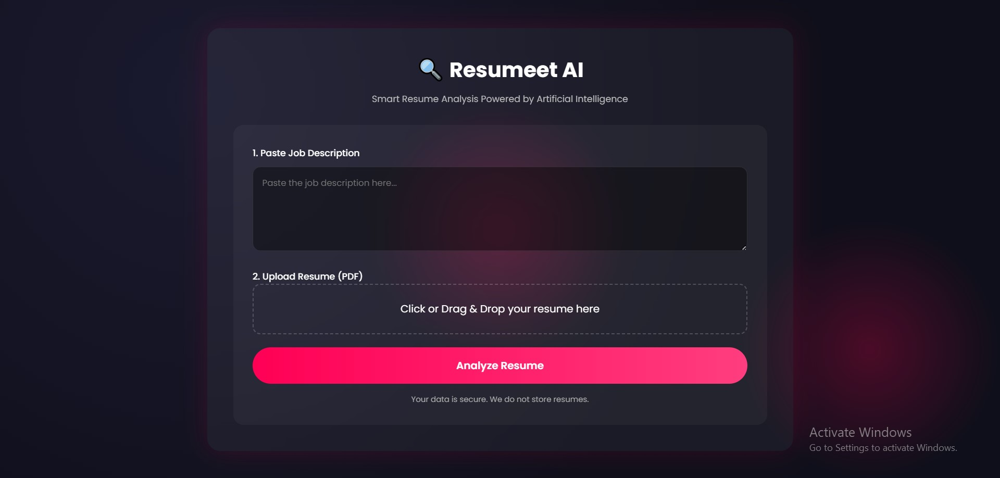
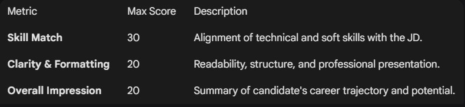

# 📄 Resumeet : AI-Analyzer

Transforming the hiring process with data-driven insights. This AI-powered system evaluates resumes against job descriptions, providing structured metrics to bridge the gap between talent and opportunity.

---

## 🚀 Overview

Most resumes get lost in the "black hole" of manual screening. This project uses advanced AI to decompose resumes into actionable data points, offering a side-by-side comparison between candidate skills and job requirements.

### ✨ Key Features

- Dual-Pane Dashboard: Visually inspect resumes alongside AI-generated insights in real-time.

- Intelligent Scoring Engine: Get granular metrics on Skill Match, Formatting, and Overall Impression.

- Context-Aware Analysis: Evaluates not just keywords, but the relevance of experience to the Job Description (JD).

- Future-Ready Architecture: Designed to easily integrate ATS compatibility checks and bias-aware evaluation.

---

## 📸 Visual Showcase



---

## 📊 Evaluation Metrics

The core engine provides structured scoring to remove subjectivity from the hiring process:



[PLACEHOLDER: Add an image of the Scoring Chart/Result UI here]

---

## 🛠️ Technical Stack

- Frontend: Streamlit

- Backend: Python

- AI Engine: Gemini API

- Parsing: pyPDF2

---

## ⚙️ Installation & Setup

- Clone the repository:
```
git clone https://github.com/yashrajkore/Resumeet.git
```

- Install dependencies:
```
pip install -r requirements.txt
```

- Run the application:
```
streamlit run app.py
```

---

## 🗺️ Roadmap

- ATS Compatibility Check: Detailed report on how well the resume passes automated parsers.
- Role-Specific Scoring: Specialized weights for Creative vs. Technical roles.
- Bias-Aware Evaluation: Ensuring fair assessment by anonymizing demographic data.

---

## 🤝 Contributing

#### Contributions are welcome! If you have a feature request or a bug report, please open an issue or submit a pull request.
---
Developed with ❤️ by Yashraj Kore